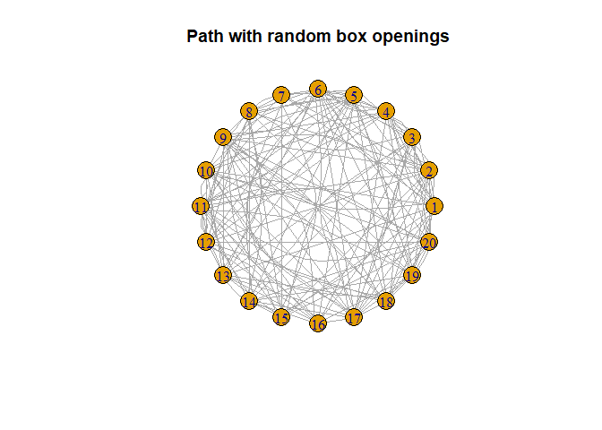
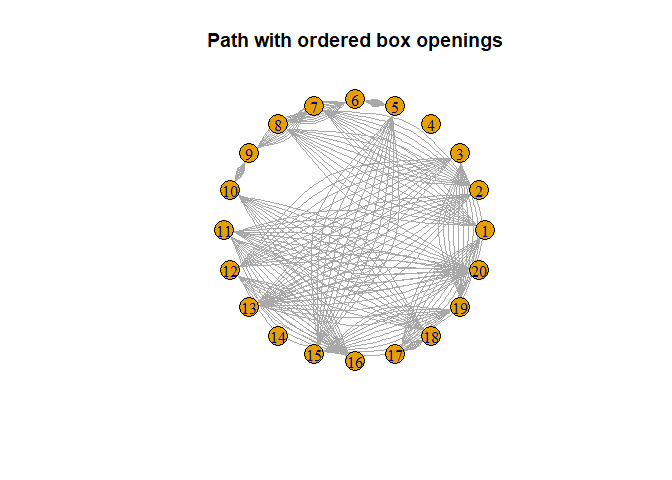

A group of 50 prisoners is called by the director where he tells them
that he feels spirited today and gives the prisoners a chance to become
free. To do this, he set up 50 boxes with in each box the name of a
prisoner in such way that every prisoners name is in one of the 50
boxes. Each prisoner may open 50 boxes to check for his/her name and if
all prisoners manage to find their own name, they are released. However,
the prisoners can only communicate before the process starts.

Almost directly, one of the prisoners mentions that this is nearly
impossible: every prisoner has 50% chance of finding his/her name and
with 100 prisoners, this gives a total chance of
0.550 = 0.0000000000000008881784. After a few minutes another
prisoner comes forward and says he can increase that chance to almost 1
out of 3. He explains: instead of random opening boxes, we number the
prisoners from 1 to 50. Then everyone starts with opening the box with
their own number and checks the name. If the name matches their own,
they're done, otherwise they go to the box with the number of that
person. That way, person 1 and person 2 have a similarity of 49/50 in
their box opening ordering and thus, if person 1 finds his/her name,
chances are very high person 2 finds his/her name as well.

This sounds almost too good to be true, so let's visualize the process
to see the results. First, we look what happens if 20 (for sake of
visualization) prisoners open 10 boxes random:

As expected, almost every path, defined as going from box *x* to box
*y*, is being used. We see that the chances of finding their own name
are independent and thus the probability of release is
0.550 ≈ 0. Now when using the approach of numbering the
prisoners and following the numbers we immediately see a pattern:

Now from every box there are only two other boxes connected: where the
prisoners come from and whereto they leave. Instead of independent
chances, now all prisoners linked up their chances and hope to get into
a cycle which leads to their own name. When the cycle they end up in, is
smaller or equal than 25, this always works: within 25 turns they are
sent to their own box. However, when the cycle is longer than 25, this
can go wrong. We can calculate the probability that a cycle is longer
than 25 and would fail. As example we take a cycle length of 30:

1.  We pick which 30 names are in the cycle. This can be done in 50 nCR
    30 ways.
2.  We pick the order of the names in the cycle, this can be done in 29!
    ways.
3.  We pick the 20 names not in the cycle, this can be done in 20! ways.

We know that the total number of sequences is 50!. Now we can calculate
the chance:

$\\dfrac{(\\matrix{50 \\\\ 30}) \\cdot 29! \\cdot 20!}{50!} = \\dfrac{\\dfrac{50!}{30!20!} \\cdot 29! \\cdot 20!}{50!} = \\dfrac{29!}{30!} = \\dfrac{1}{30}$
Hence, the chance for a cycle with length *n* is $\\dfrac{1}{n}$ and it
follows that the chance there is **no** cycle of larger than 25 is: $ 1
- - - - = 0.31675...$
